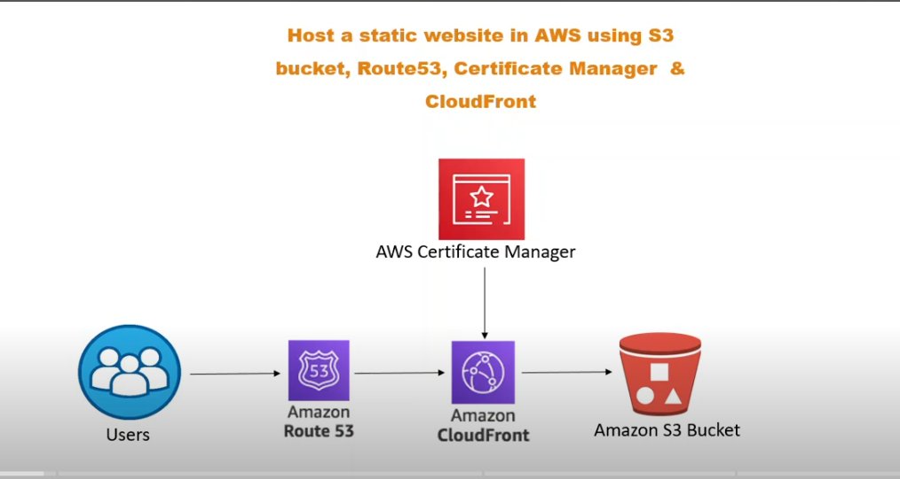
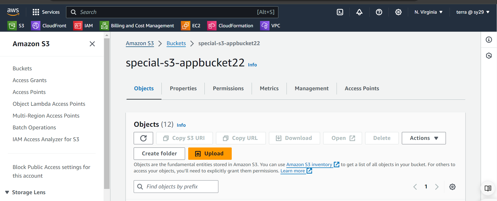

# Deploy a Static Website on AWS using Terraform

## Objective
Create an AWS infrastructure to host a static website using Terraform. The infrastructure will include:
- **AWS S3**: For storing the website files.
- **CloudFront**: For content delivery.
- **Route 53**: For domain name management.

## Prerequisites
- An AWS account
- Terraform installed on your local machine
- Domain name registered with Route 53

###Modules
Project were structured in modules each module contain configurations for each resource
## S3 Module
This module handles the creation of the S3 bucket to store the website files.

### main.tf
* **`aws_s3_bucket` Resource:**
    - Creates an S3 bucket
    - Bucket name is specified in the `bucket_name` variable.

* **`force_destroy` Attribute (Optional):**
    - Set to `true` to allow deletion of the S3 bucket even if it contains objects.
    - **Caution:** Use with care, as it can lead to unintended data loss.

* **`aws_s3_object` Resource:**
    - Uploads files from the `webapp` directory to the S3 bucket.
    - Uses the `for_each` function to iterate over each file in the directory.
    - Uploads each file to the S3 bucket with the corresponding key and content type.
### output.tf
The `outputs.tf` file defines outputs that expose information about the resources created by your S3 module. These outputs can be used by other Terraform configurations or accessed from the command line.
* **`s3-bucket`:** Provides details about the created S3 bucket. This likely includes the bucket name (potentially via the `id` attribute) and possibly other relevant attributes like the ARN.
* **`aws_s3_object` (Optional):** If your module also handles uploading objects to the S3 bucket, this output could provide information about the uploaded objects. However, Terraform outputs typically handle single values, not collections like object details. Consider alternative approaches for managing object details, such as storing them in a separate data source or leveraging Terraform Cloud workspaces to share the information.

### CloudFront Module
This module handles the creation of the CloudFront distribution to serve the website files stored in the S3 bucket and ensures secure access using an origin access identity and SSL/TLS certificate.

#### Description
- **CloudFront Distribution**:
  - The distribution is created to serve the contents of the S3 bucket.
  - The S3 bucket is specified as the origin, and an origin access identity is configured to restrict access to the S3 bucket.
  - The distribution settings include enabling IPv6, setting the default root object to `index.html`, and adding a descriptive comment.
  - The caching behavior is defined to allow only `GET` and `HEAD` methods, with a viewer protocol policy set to redirect HTTP to HTTPS.
  - The pricing class is set to `PriceClass_100`, and there are no geo-restrictions applied.
  - An ACM certificate is specified for SSL/TLS, with support for SNI-only and a minimum protocol version of TLS 1.2.

- **CloudFront Origin Access Identity**:
  - An origin access identity is created to securely access the S3 bucket.
  - This ensures that the S3 bucket can only be accessed through the CloudFront distribution.

- **S3 Bucket Policy**:
  - A bucket policy is attached to the S3 bucket to allow access only through the CloudFront distribution using the origin access identity.
  - The policy grants `s3:GetObject` permissions to the CloudFront origin access identity.

#### Outputs.tf
- **CloudFront Distribution**:
  - The details of the created CloudFront distribution are output for reference.

#### Variables.tf
- **S3 Bucket**:
  - The variable for the S3 bucket is used to pass the S3 bucket details to the CloudFront distribution.
- **ACM Certificate ARN**:
  - The variable for the ACM certificate ARN is used to specify the SSL/TLS certificate for the CloudFront distribution.

### Certificate Module
This module handles the creation and validation of an ACM (AWS Certificate Manager) certificate for the domain, using Route 53 for DNS validation.

#### Description
- **ACM Certificate**:
  - An ACM certificate is created for the specified domain name.
  - DNS is used as the validation method to verify ownership of the domain.
  - The lifecycle policy ensures that the certificate is created before any existing certificate is destroyed.
  - Tags are added to the certificate for identification and management purposes.

- **Route 53 Record for Certificate Validation**:
  - Route 53 DNS records are created to validate the domain ownership for the ACM certificate.
  - Each DNS validation option provided by ACM is processed to create the necessary DNS records in the specified Route 53 hosted zone.
  - The DNS records include the name, type, and value required for validation, with a TTL (Time to Live) set to 60 seconds.

- **ACM Certificate Validation**:
  - The ACM certificate validation resource uses the DNS records created in Route 53 to validate the certificate.
  - The certificate ARN and the fully qualified domain names (FQDNs) of the validation records are specified for the validation process.

#### Outputs
- **ACM Certificate**:
  - The details of the created ACM certificate are output for reference.

#### Variables
- **Domain Name**:
  - The variable for the domain name is used to specify the domain for which the ACM certificate is created.
- **Route 53 Zone ID**:
  - The variable for the Route 53 hosted zone ID is used to specify where the DNS validation records should be created.

### Route 53 Module
This module handles the creation of a Route 53 hosted zone and the configuration of DNS records to route traffic to the CloudFront distribution.

#### Description
- **Route 53 Hosted Zone**:
  - A Route 53 hosted zone is created for the specified domain name.
  - Tags are added to the hosted zone to identify the environment (e.g., development, production).

- **Route 53 Record for CloudFront**:
  - A DNS record is created in the hosted zone to route traffic for the `www` subdomain to the CloudFront distribution.
  - The record type is set to `A` and is configured as an alias to the CloudFront distribution's domain name.
  - The CloudFront distribution's domain name and hosted zone ID are specified to correctly route the traffic.

#### Outputs
- **Route 53 Hosted Zone**:
  - The details of the created Route 53 hosted zone are output for reference.

#### Variables
- **Domain Name**:
  - The variable for the domain name is used to specify the domain for which the Route 53 hosted zone is created.
- **Environment**:
  - The variable for the environment is used to tag the hosted zone (e.g., development, production).
- **CloudFront Domain Name**:
  - The variable for the CloudFront domain name is used to specify the domain name of the CloudFront distribution for the alias record.
- **CloudFront Hosted Zone ID**:
  - The variable for the CloudFront hosted zone ID is used to specify the hosted zone ID of the CloudFront distribution for the alias record.

## Conclusion
Your static website should now be live and accessible via the domain name configured in Route 53, served through CloudFront, with files stored in an S3 bucket.

## Troubleshooting
- Ensure your AWS credentials are correctly configured.
- Check for typos or misconfigurations in your Terraform files.
- Review the AWS Management Console for any error messages related to the resources.
